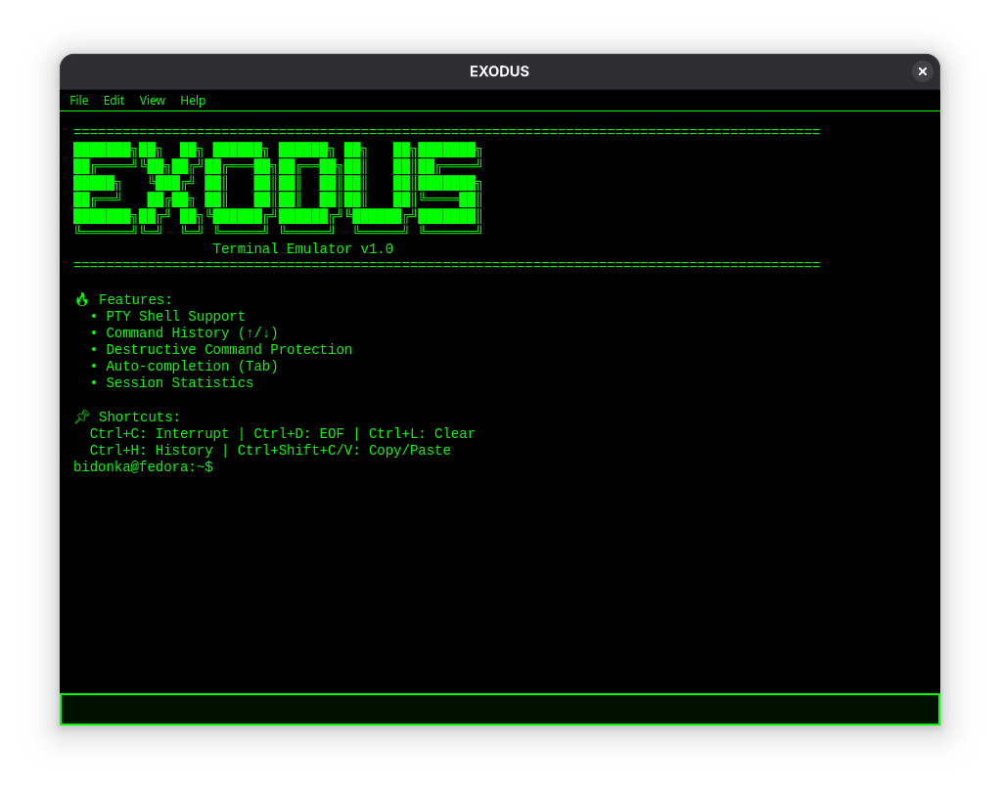

# EXODUS Terminal

Advanced PTY terminal emulator with enhanced features, built with PyQt5.



## Features

- Full PTY terminal emulation
- Command history with persistence
- Destructive command protection
- Session statistics and logging
- Multiple color schemes (Matrix green, Amber, Blue, Red)
- Auto-completion support
- Signal handling (Ctrl+C, Ctrl+Z, etc.)
- Easy installation with one command

## Requirements

- Python 3.11+
- PyQt5
- Linux (tested on Fedora/Ubuntu)

Install dependencies:

```bash
pip install pyqt5
```
Installation
```bash
git clone https://github.com/bidonkka/EXODUS-Terminal.git
cd EXODUS-Terminal
cd EXODUS
chmod +x install.sh
 ./install.sh
```

